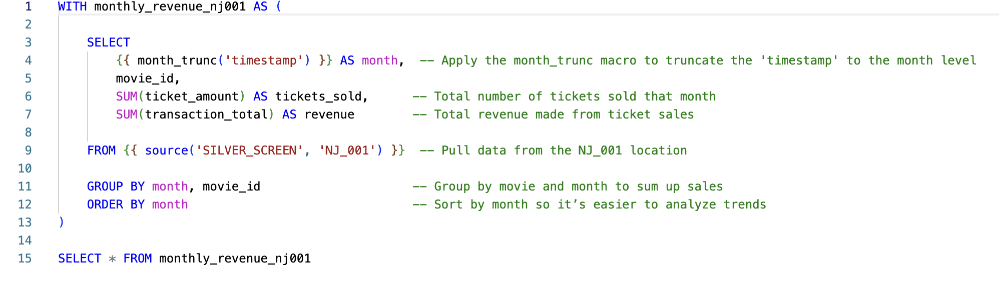
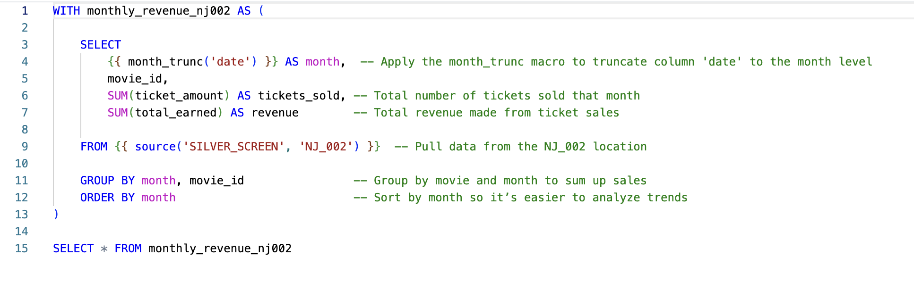
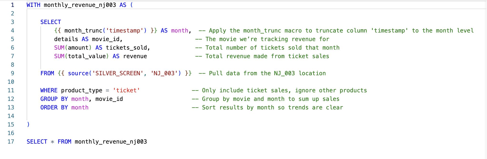

#  Facts Models – Monthly Ticket Revenue  

This folder contains **fact models** that aggregate **monthly ticket revenue** for each Silver Screen theater location. These models transform raw transaction data from different sources into structured and aggregated datasets.  

##  What These Models Do:
- Extract **monthly ticket sales and revenue** for each location.
- Ensure consistency by unifying data from different formats.
- Serve as the foundation for further transformations in the **intermediate and final models**.

## 📂 Models in This Folder:
Each model processes data for a specific **Silver Screen** location, using the **`dbt source()`** function to reference raw transactional data.

### **📄 [fact_monthly_ticket_revenue_nj001.sql](./fact_monthly_ticket_revenue_nj001.sql)**  
This model aggregates **ticket sales and revenue** for **NJ_001**, using data from `SILVER_SCREEN.NJ_001`.  

---

### **📄 [fact_monthly_ticket_revenue_nj002.sql](./fact_monthly_ticket_revenue_nj002.sql)**  
This model aggregates **ticket sales and revenue** for **NJ_002**, using data from `SILVER_SCREEN.NJ_002`.  

---

### **📄 [fact_monthly_ticket_revenue_nj003.sql](./fact_monthly_ticket_revenue_nj003.sql)**  
This model aggregates **ticket sales and revenue** for **NJ_003**, using data from `SILVER_SCREEN.NJ_003`.  

---

##  How These Models Work:
- **Source Data**: Each model extracts raw transaction data from the `SILVER_SCREEN` schema using `dbt source()`.  
- **Aggregation**: Instead of hardcoding `DATE_TRUNC('month', timestamp)`, these models leverage the **`month_trunc()` macro** to standardize monthly aggregation across all locations.  
- **Filtering**: The NJ_003 dataset required **filtering** to exclude non-ticket transactions before aggregation.  
- **Consistency**: Since different locations had different data formats, transformations ensured uniformity across all models.  

➡️ **[Next Model](../intermediate)** 🔗  
_Click the link above to explore the next transformation step._  
