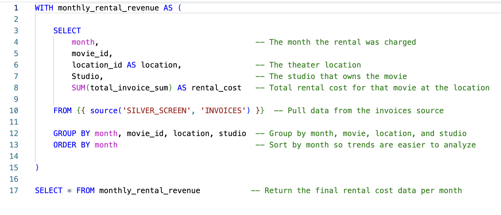
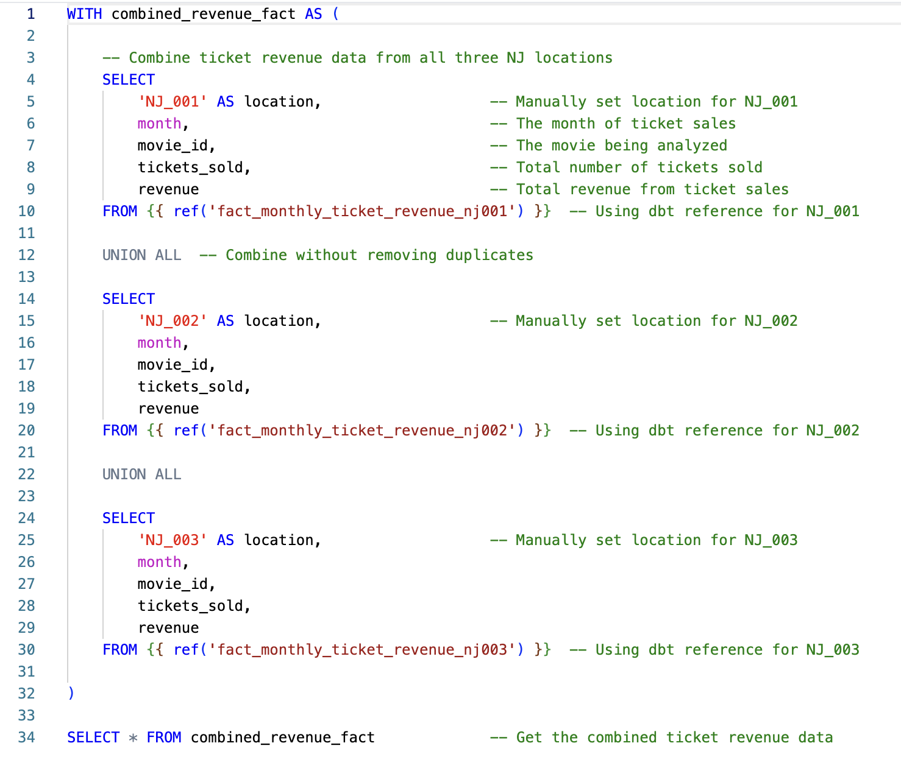
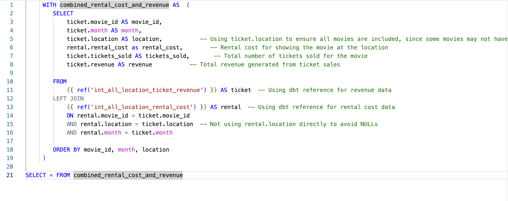

#  Intermediate Models – Data Unification & Transformation

This folder contains **intermediate models** that unify, clean, and aggregate data before moving to the final reporting stage. These transformations bridge the gap between **fact models** and the **final mart model** by ensuring consistency and completeness in the data.

##  What These Models Do:
- Integrate **rental cost** and **ticket revenue** across all locations.
- Standardize data formats to align different source structures.
- Prepare a **consolidated dataset** that feeds into the final reporting model.

## 📄 Models in This Folder:

- [`int_all_location_rental_cost.sql`](int_all_location_rental_cost.sql) – Aggregates **monthly rental costs** for each location.  
  

- [`int_all_location_ticket_revenue.sql`](int_all_location_ticket_revenue.sql) – Combines ticket revenue from all locations into a unified view.  
  

- [`int_combined_rental_cost_and_revenue.sql`](int_combined_rental_cost_and_revenue.sql) – **Joins** rental cost and ticket revenue into a single dataset.  
  

##  How These Models Work:
- **Data Sources:** These models reference fact models such as `fact_monthly_ticket_revenue_nj001`, `fact_monthly_ticket_revenue_nj002`, etc., using the **dbt `ref` function** to maintain dependencies.
- **Transformation Techniques:**  
  - **Aggregation:** Uses `SUM()` to calculate totals for rental costs and ticket sales.  
  - **Date Standardization:** Applies `DATE_TRUNC('month', date)` to ensure uniform monthly granularity.  
  - **Joins:** Merges rental cost and ticket revenue data to create a single structured dataset.

➡️ **[Next Model](../marts)** 🔗  
_Click the link above to explore the next transformation step._
