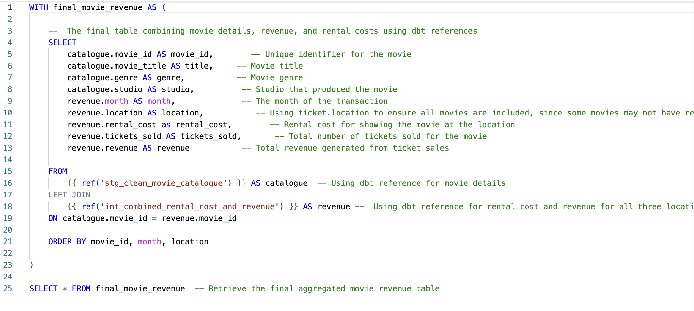

#  Marts - Final Movie Revenue

This folder contains the **final mart model**, which aggregates all relevant data into a structured format for business analysis. The **mart_final_movie_revenue** model provides a **monthly summary of movie performance per movie, per location, and per month** across all **Silver Screen** theater locations.

##  What This Model Does:
- **Unifies data** from multiple sources into a single table.
- **Summarizes** monthly **revenue, tickets sold, and rental costs** per movie per location and per month.
- **Ensures completeness** by including all movies, even if rental cost data is missing.

## 📄 Model in This Folder:

- [`mart_final_movie_revenue.sql`](mart_final_movie_revenue.sql) - The final table summarizing **rental costs, ticket sales, and revenue per movie, per location, and per month**.  
  

##  How This Model Works:
- **Data Sources**:
  - 🎥 `stg_clean_movie_catalogue` → Provides **movie details** (title, genre, studio).
  - 💰 `int_combined_rental_cost_and_revenue` → Combines **rental costs and revenue** from all three locations.
- **Joins & Transformations**:
  - Uses **dbt references (`ref()`)** to dynamically connect the sources.
  - Ensures **location consistency** by using `revenue.location` instead of `rental.location`, avoiding missing data.
  - Orders data by **movie_id, month, and location** for structured reporting.

➡️ **[Proceed to Testing the Models](../../test)** 🔗  
_This link takes you to the next step in the process, where we validate the models using custom tests to ensure data accuracy and consistency._
