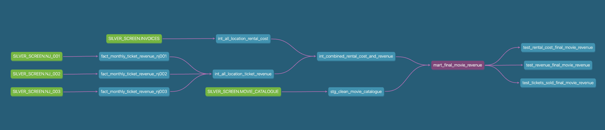

# ❄️ Snowflake – Transformed Data

This folder contains **visual representations** of the transformed data stored in Snowflake after running dbt models. The transformations performed in dbt resulted in the creation of **Tables** and **Views**, which serve as the foundation for further analysis.

##  **DBT Build Execution**
Before moving into the DAG and final tables, we ran **dbt build**, which executed and tested all models successfully.  
Below are the results of the build process:

  

---

##  **Data Flow Overview (DAG)**
To understand how data flows through this pipeline, refer to the **DAG (Directed Acyclic Graph) below**. This diagram outlines how raw data from **Silver Screen's sources** is processed step-by-step through **staging, transformation, and final reporting layers** before undergoing testing.

---
##  **DBT_TRANSFORMED Schema**
After processing, the transformed data is structured into **Tables** and **Views** within Snowflake.

###  **Tables Created:**
- **Fully materialized tables** store **aggregated and processed data**, making them available for further analysis and reporting.

| Table Name                           | Description |
|--------------------------------------|-------------|
| `INT_ALL_LOCATION_RENTAL_COST`      | Aggregated rental costs across locations. |
| `INT_ALL_LOCATION_TICKET_REVENUE`   | Combined ticket revenue from different theaters. |
| `INT_COMBINED_RENTAL_COST_AND_REVENUE` | Unified rental cost and ticket revenue. |
| `MART_FINAL_MOVIE_REVENUE`          | The final reporting table with revenue insights. |
| `STG_CLEAN_MOVIE_CATALOGUE`         | Cleaned staging data for movie details. |

.png)

---
###  **Views Created:**
- **Views are logical representations** of data that improve query performance while reducing storage needs.

| View Name                              | Description |
|--------------------------------------|-------------|
| `FACT_MONTHLY_TICKET_REVENUE_NJ001` | Monthly ticket revenue for **NJ_001**. |
| `FACT_MONTHLY_TICKET_REVENUE_NJ002` | Monthly ticket revenue for **NJ_002**. |
| `FACT_MONTHLY_TICKET_REVENUE_NJ003` | Monthly ticket revenue for **NJ_003**. |

.png)

---
##  **How These Tables & Views Are Used:**
- **Tables** are used for reporting, analytics, and further transformations.
- **Views** optimize performance by allowing dynamic aggregation when queried.

---

## 🎉 Thank You for Exploring This Project!
This marks the **final step** of the data pipeline. I appreciate you taking the time to explore the project, from **raw data sources to transformed models and testing validation**. If you have any questions or feedback, feel free to reach out! 🚀

➡️ **[Back to Project Overview](../README.md)** 🔗
