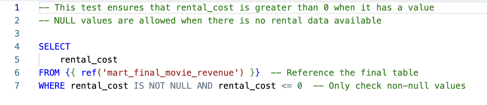
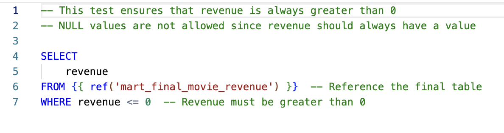
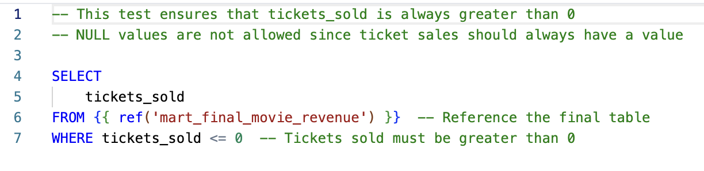

# ✅ Test Folder – Data Validation

This folder contains **custom SQL tests** to ensure data integrity in the `mart_final_movie_revenue` model. These tests validate key business metrics and enforce quality checks on critical columns.

##  Purpose of These Tests:
- Ensure **rental cost** is valid (greater than 0 when available).
- Validate **revenue** values are never negative or zero.
- Confirm **tickets sold** is always greater than 0.

## 📂 Test Files:

- 📝 [`test_rental_cost_final_movie_revenue.sql`](test_rental_cost_final_movie_revenue.sql) – Ensures `rental_cost` is **greater than 0**, while allowing `NULL` values when rental data is missing.  
  

- 📝 [`test_revenue_final_movie_revenue.sql`](test_revenue_final_movie_revenue.sql) – Verifies `revenue` is always **greater than 0**.  
  

- 📝 [`test_tickets_sold_final_movie_revenue.sql`](test_tickets_sold_final_movie_revenue.sql) – Confirms `tickets_sold` is **greater than 0**, as ticket sales should always have a valid count.  
  

##  How These Tests Work:
- **Validation Queries:** These tests run SQL queries on `mart_final_movie_revenue` to detect invalid values.
- **Data Integrity Enforcement:** If any test fails, it indicates potential data quality issues.
- **Reference to Final Model:** The tests use `{{ ref('mart_final_movie_revenue') }}` to dynamically check data.

➡️ **[View Snowflake Tables & Views](../snowflake)** 🔗  
_Explore the final tables and views generated in Snowflake as part of the data modeling and transformation process._
